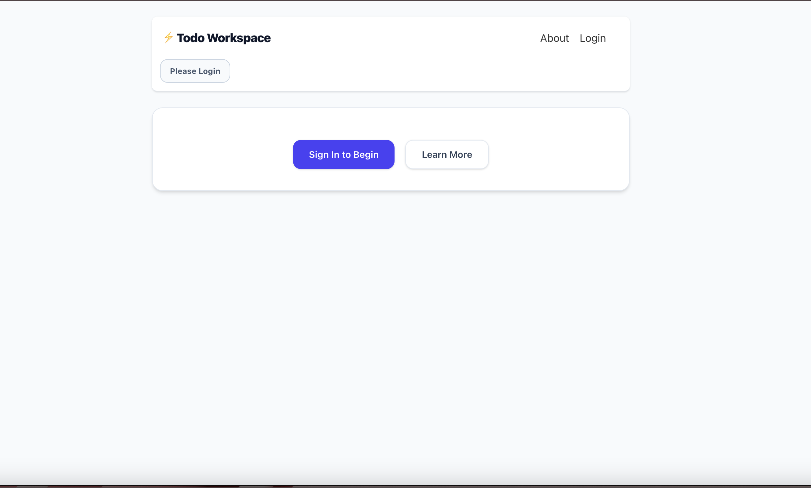
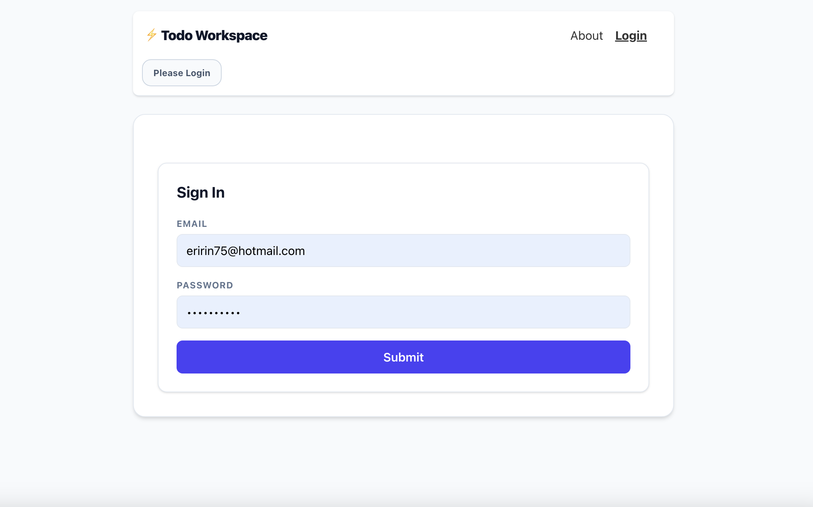
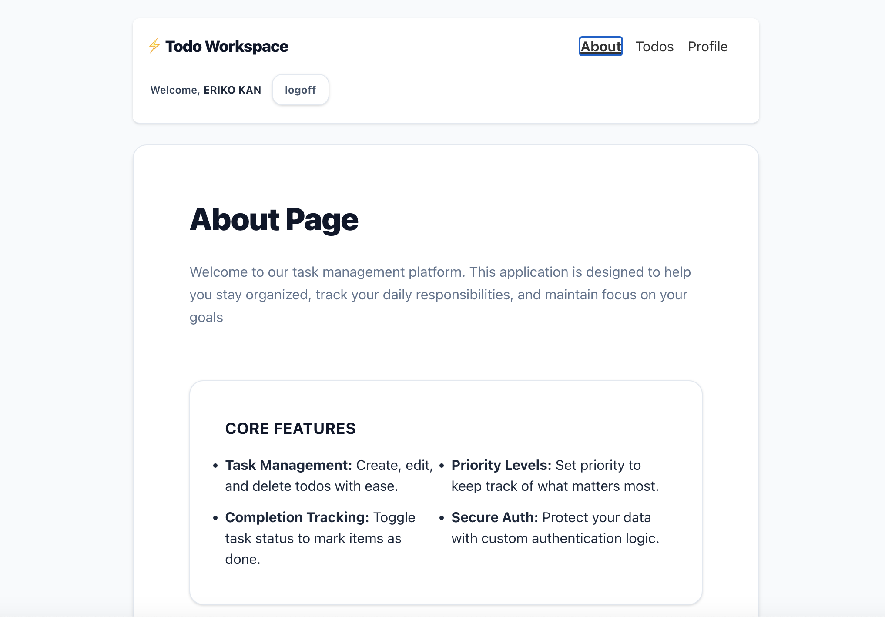
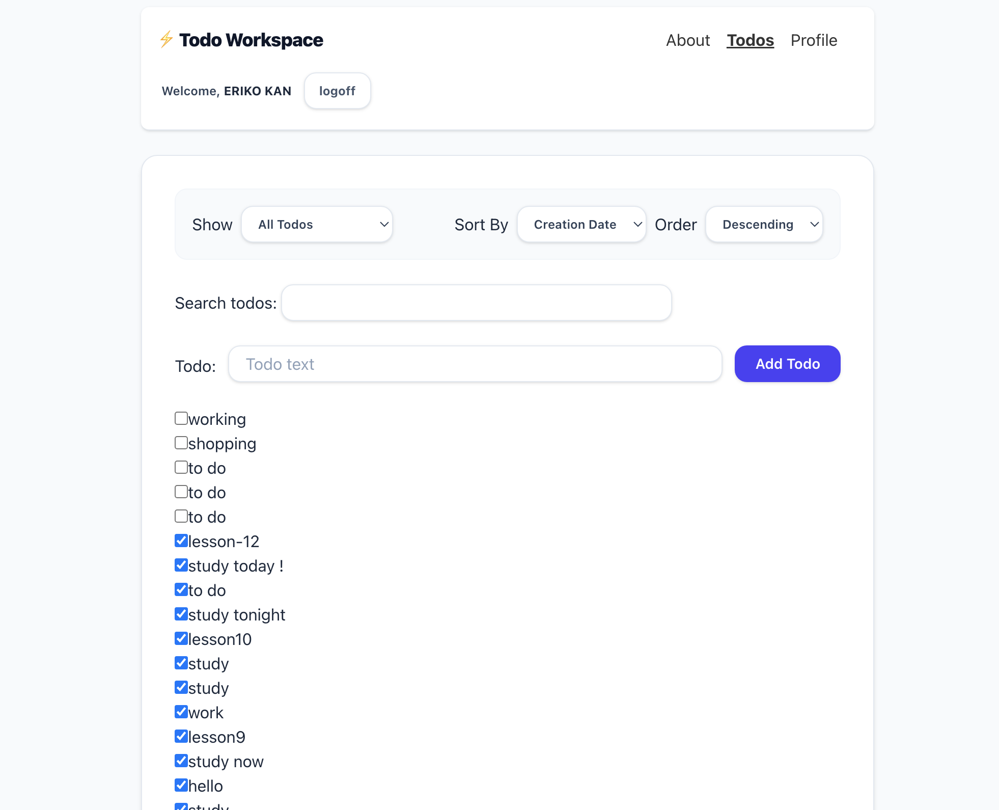
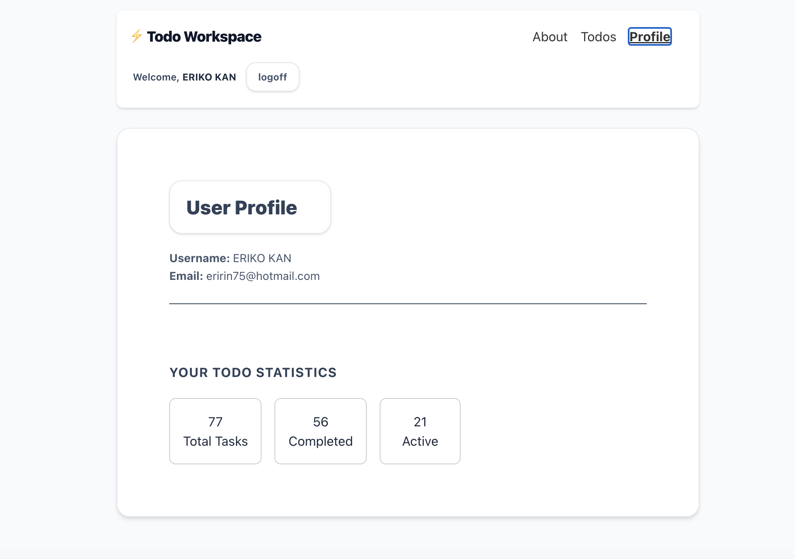
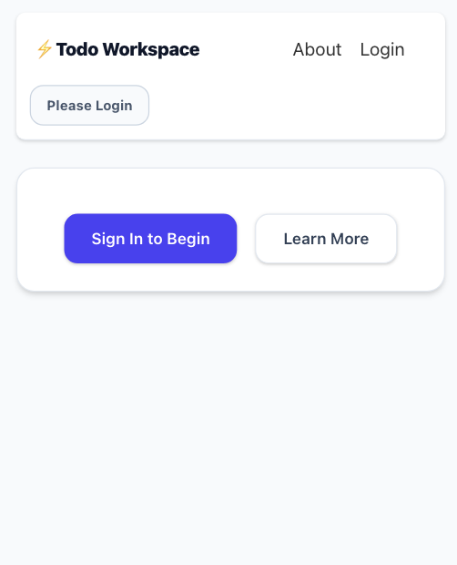
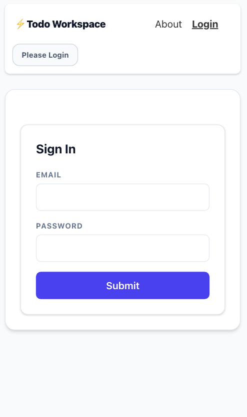
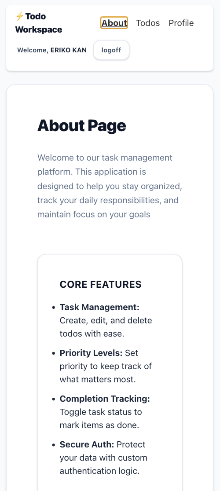
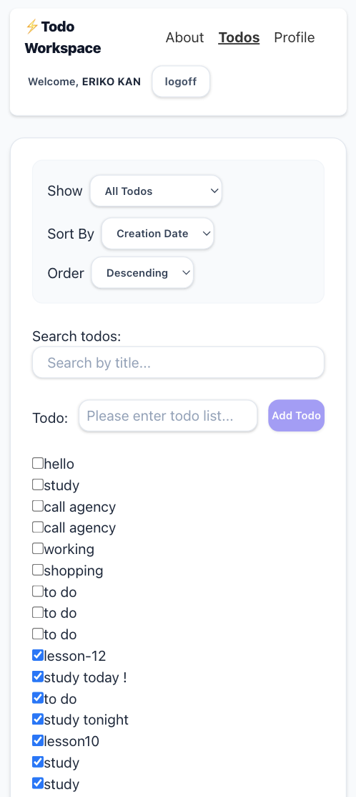
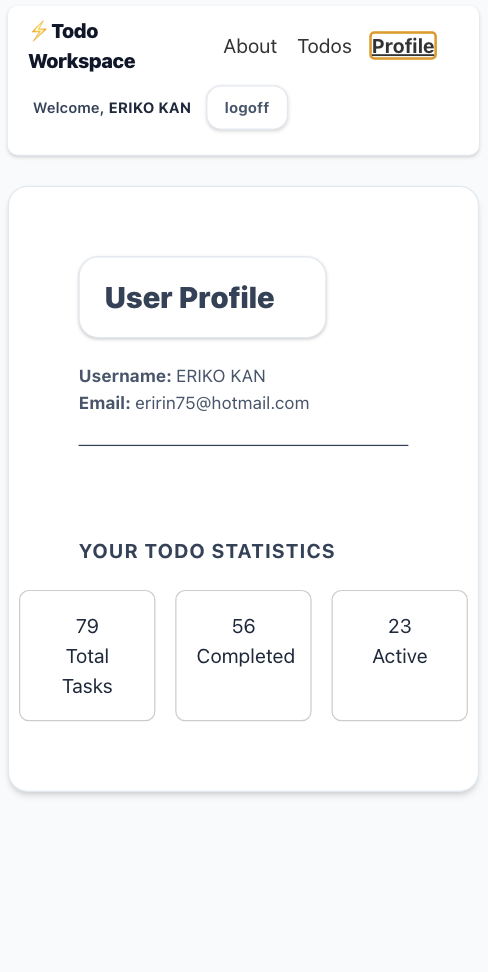

# ⚡ Todo Workspace

A frontend Todo application built with React and Vite. Features user authentication, real-time filtering, sorting, and optimistic UI updates for a seamless user experience.

---

## 🔗 Live Demo

> [Click here to see live demo](https://ctd-react-course-assignment-git-lesson-11-eriko-kan-s-projects.vercel.app)

## 🔗 Video demonstration Youtube

> [Click here to see Youtube](https://youtu.be/tlJphJ7MmDY)

---

## ✨ Features

- **User Authentication** — Secure login and logout with session-based auth and CSRF protection
- **Add Todos** — Create new todos with input validation and sanitization
- **Complete Todos** — Mark todos as complete or active with optimistic UI updates
- **Edit Todos** — Inline editing with instant UI feedback and server sync
- **Filter by Status** — Filter todos by All, Active, or Completed via URL params
- **Search Todos** — Debounced search input to filter todos by title
- **Sort Todos** — Sort by creation date or title, ascending or descending
- **Error Handling** — Rollback on failed requests with user-facing error messages
- **Responsive Design** — Mobile-friendly layout using Tailwind CSS

---

## 🛠 Technologies Used

**Frontend**
- React 19
- React Router v7
- Tailwind CSS v4
- DOMPurify (input sanitization)
- Vite v8

**Dev Tools**
- ESLint
- GitHub (version control)

---

## 📸 Screenshots

Desktop View







Mobile View







---

## 🚀 Getting Started

### Prerequisites

- Node.js v18+
- npm v9+

### Installation

1. Clone the repository
```bash
git clone https://github.com/eririn318/ctd-lesson1-todo-list.git
cd ctd-lesson1-todo-list
```

2. Install dependencies
```bash
npm install
```
3. Set up environment variables

```bash
cp .env.example .env
```

The `.env` file should contain: 
```
VITE_TARGET=https://ctd-learns-node-l42tx.ondigitalocean.app
```

4. Start the development server
```bash
npm run dev
```

5. Open your browser at `http://localhost:3001`

---

## 📜 Available Scripts

| Script | Description |
|---|---|
| `npm run dev` | Starts the Vite development server with HMR |
| `npm run build` | Builds the app for production |
| `npm run preview` | Previews the production build locally |
| `npm run lint` | Runs ESLint to check for code issues |

---

## 🎨 Design Decisions

**Tailwind CSS v4** was chosen for utility-first styling, enabling rapid and consistent UI development without writing custom CSS files.

**Optimistic Updates** were implemented for add, complete, and edit operations to give users instant feedback while the server processes requests in the background. Failed requests automatically roll back to the previous state.

**URL-based filtering** using React Router's `useSearchParams` allows users to bookmark and share filtered views of their todo list.

**`useReducer`** was chosen over multiple `useState` calls to centralize state management logic, making the codebase easier to maintain and debug as complexity grew.

**DOMPurify** was used for input sanitization to prevent XSS attacks before saving user input.

---

## 🔮 Future Improvements


- Add due dates and priority levels to todos
- Drag and drop reordering
- Dark mode toggle
- TypeScript migration for type safety
- Unit tests with Vitest and React Testing Library


---

## 📄 License

This project is licensed under the [MIT License](LICENSE).

---

## 👤 Contact

- GitHub: [@eririn318](https://github.com/eririn318)
- Portfolio: Coming soon